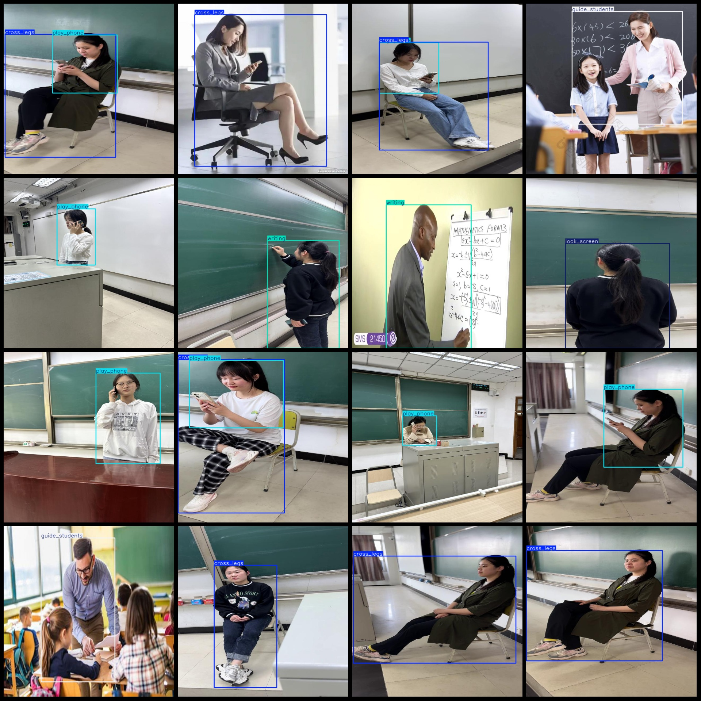

# Wisdom Classroom Teacher Behavior Detection Dataset VOC+YOLO Format: 3898 Images in 6 Categories

Dataset format: Pascal VOC format + YOLO format (without split path in the txt file, only containing jpg images and corresponding VOC format xml files and yolo format txt files)
Number of images (jpg file count): 3898
Number of annotations (xml file count): 3898
Number of annotations (txt file count): 3898
Number of annotation categories: 6
Annotation category names (note that the order of labels in the yolo format is not consistent with this, but according to the labels folder "classes.txt"): ["cross_legs", "guide_students", "look_screen", "play_phone", "teaching_asking", "writing"]
Number of bounding boxes per category:
cross_legs (Kneeling) = 1192
guide_students (Guiding Students) = 626
look_screen (Looking at Screen/Board Writing) = 289
play_phone (Playing Phone) = 1295
teaching_asking (Teaching Asking) = 564
writing (Writing) = 312
Total bounding box count: 4278
Image resolution: 640x640
Annotation tool used: labelImg
Annotation rules: Draw a bounding box around each category
Important note: No special declarations are made
Special statement: This dataset does not guarantee the accuracy of the trained models or weight files
Image preview:

## Image

Here is a pay link on Stripe ( https://buy.stripe.com/3cs8yP7sY87d0vu9AB ). Please contact me lonlonago@foxmail.com after funding $89, and I will send you a complete data files , thank you!

